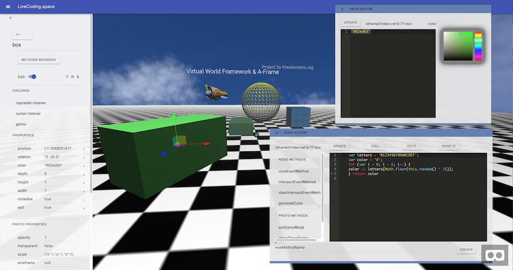
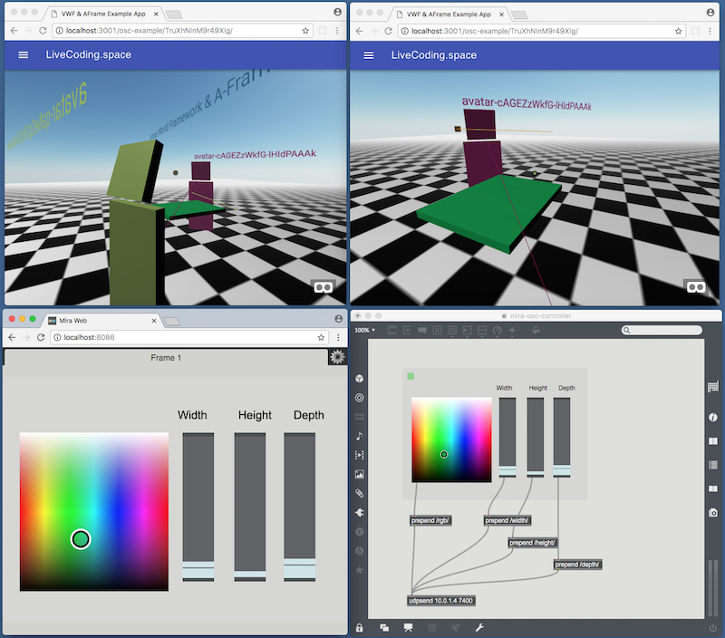
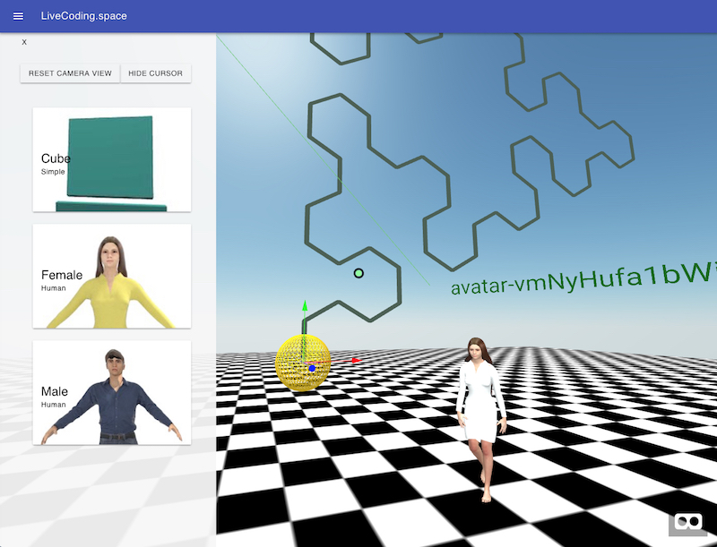

# LiveCoding.space repository

> Collaborative Live Coding Space with support of user-defined languages and WebVR ready 3D graphics

Based on:  [Virtual World Framework](https://github.com/virtual-world-framework/vwf) | [A-Frame](https://aframe.io) | [Ohm language](https://github.com/harc/ohm) | [OSC.js](https://github.com/colinbdclark/osc.js/) | and more...  
Online at: **https://livecoding.space**


**To run**

```
npm install
```
```
npm run
```

## Features

- Decentralized network model for A-Frame components and entities based on VWF replicated computation architecture
- Ohm language driver for sharing user-defined grammars, parsers, tokenisers inside virtual space
- In browser Code and Properties editor based on [Cell.js](https://github.com/intercellular/cell)
- OSC messaging through [OSC realy](https://github.com/NikolaySuslov/osc-relay-lcs) on the client
- Avatars
..


<br>

<br>

<br>

## Docs
..soon